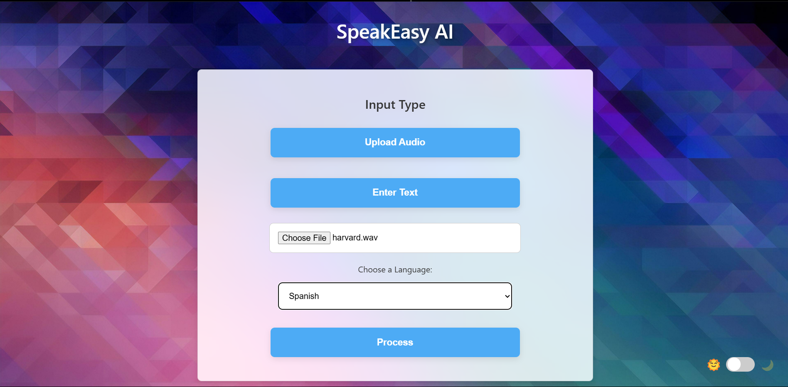

# 🌍 Multilingual News Audio Translator

**Real-Time Multilingual News Broadcasting System**  
Seamlessly convert live news audio into multiple languages with speech recognition, neural translation, and text-to-speech synthesis.





## 🚀 Project Overview

The Multilingual News Audio Translator is an end-to-end system that enables real-time translation of news audio into multiple target languages, helping break down language barriers in global news consumption.  
It leverages state-of-the-art models for **Automatic Speech Recognition (ASR)**, **Neural Machine Translation (NMT)**, and **Text-to-Speech (TTS)**.

### 🎯 Key Features
- 🎙️ **ASR:** High-accuracy speech recognition using Wav2Vec 2.0 + CTC Loss.
- 🌐 **NMT:** Language translation using mBART, enhanced with Reinforcement Learning (BLEU reward).
- 🔊 **TTS:** Natural-sounding speech synthesis with FastSpeech 2 + Knowledge Distillation.
- ⚡ **Real-Time Performance:** Optimized for low-latency translation and audio generation.
- 🌎 **Multilingual Support:** Hindi, Gujarati, French, German, and more.

## 🧩 System Architecture

```
Input Audio → ASR (Wav2Vec 2.0) → Text → NMT (mBART + RL) → Translated Text → TTS (FastSpeech 2) → Output Audio
```

### Language Pipeline:
- **Source Audio:** English / Hindi / Gujarati / French / German
- **Target Output:** Multilingual audio streams in real-time

## 🏗️ Tech Stack

| Task | Model | Tools/Libraries |
|------|-------|----------------|
| ASR  | Wav2Vec 2.0 + CTC | PyTorch, Transformers |
| NMT  | mBART + Reinforcement Learning | Fairseq, HuggingFace, BLEU Scorer |
| TTS  | FastSpeech 2 + Knowledge Distillation | ESPnet, Librosa, PyTorch |
| Others | Streamlit (Optional), Docker (for deployment), TensorBoard (monitoring) |

## 📂 Dataset

- **ASR Training:** LibriSpeech (English), Hindi OpenSLR datasets
- **NMT Training:** WMT Dataset, OPUS Corpus
- **TTS Training:** LJSpeech, Multilingual LibriTTS

> *Note:* All datasets used comply with their respective licenses.

## ⚙️ Setup & Installation

1. **Clone the repository**
```bash
git clone https://github.com/your-username/multilingual-news-audio-translator.git
cd multilingual-news-audio-translator
```

2. **Create and activate a virtual environment**
```bash
python -m venv venv
source venv/bin/activate  # Linux/Mac
venv\Scripts\activate     # Windows
```

3. **Install dependencies**
```bash
pip install -r requirements.txt
```

4. **Train or load pre-trained models**
```bash
# Example: Training ASR model
python train_asr.py
```

5. **Run the pipeline**
```bash
python main.py --input_audio sample_news.wav
```

## 🧪 Evaluation

- BLEU Score for translation evaluation
- WER (Word Error Rate) and CER (Character Error Rate) for ASR performance
- MOS (Mean Opinion Score) for TTS audio quality

## 📈 Progress

- ✅ Dataset Collection & Preprocessing
- ✅ ASR Model Training & Testing
- ✅ NMT Model Training with Reinforcement Learning
- ✅ TTS Model Training with Knowledge Distillation
- 🚧 Real-time Streaming Integration
- 🚧 Deployment (Dockerization, API Endpoint)

## 📝 Future Work

- Add more target languages (Arabic, Spanish, Italian, Japanese, Korean, Tamil)
- Web-based UI for real-time audio translation
- Model compression for edge deployment
- Sentiment-aware translation tone adaptation

## 🤝 Contributing

We welcome contributions!  
If you have suggestions or improvements, feel free to open an issue or submit a pull request.

1. Fork the project
2. Create your feature branch (`git checkout -b feature/YourFeature`)
3. Commit your changes (`git commit -m 'Add your feature'`)
4. Push to the branch (`git push origin feature/YourFeature`)
5. Open a pull request

## 📜 License

This project is licensed under the MIT License - see the [LICENSE](LICENSE) file for details.

## 🙌 Acknowledgements

- HuggingFace 🤗
- Fairseq by Facebook AI
- ESPnet for TTS
- Open-source contributors and dataset providers
